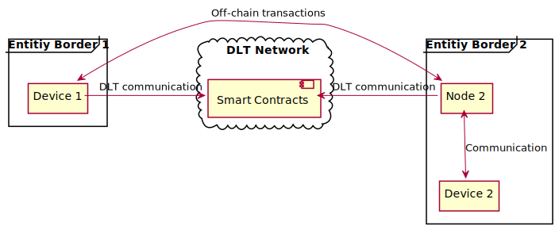
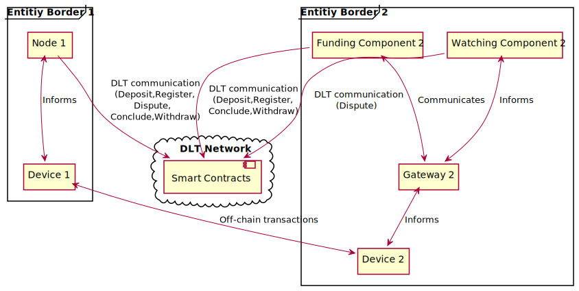

<!-- This is a template for proposing design changes to the perun project. -->

# Proposal: IoT Adoption

* Author(s): Daniel Kunz<!-- Author, Co-Author -->
* Status: accept
* Related issue: <!-- org-name/project#NNN, org-name/project#NNN. -->

<!-- Use the above format for issues on github and full links for issues on other platforms. -->

## Summary

Figure 1 shows how state channels help to reduce the number of transactions with the underlying DLT by shifting most transactions directly to the peer-to-peer channel which is set up between two state channel nodes. While this enables many use cases, the technology is currently not tailored for constrained (memory, compute, connectivity) IoT devices. To reduce the resource consumption, the functionality can be split between a light client and a state channel node. The state channel node will be responsible for setting up the channels, handling disputes and settling them, while the light client will be will be used only for transacting on these channels.

By separating the setup of the channels from the transaction over the channels both physically (node is responsible for DLT communication, device for peer-to-peer transactions   as well as updating node in periodic time slots; cf. Figure 2) and logically (the entity funding a channel, e.g. a node, can be different from the one using the channel for transactions, e.g. the device; cf. Figure 3), constrained IoT devices are entirely decoupled from any direct DLT communication (for channel opening, watching for disputes and closing) but can still participate in a 2nd layer state channel protocol and use that for direct peer-to-peer transactions. In addition, a gateway can be applied if a device has limited connectivity to communicate to the new components, which are handling the DLT communication.

## Motivation

The main advantage in the invention sketched in section 1 above, is that we can have restricted devices directly participate in peer-to-peer transactions while retaining the security / trust guarantees of a 2nd layer state channel protocol: to enable that we reduce the functionality required to be implemented in the device / agent by separating setting up and funding the state channels from the transactions via the channel (see Figure 2 and Figure 3).

## Details

Separating the functionality to reduce the needed available implementation and communication on a device. In general, the idea of a watchtower [3] is to react if the corresponding entity is offline or loses connectivity. Targeting IoT devices, the general assumption is that these devices have limited capabilities in regard to connectivity. Therefore, the watchtower or a watching function will run separately.

## Rationale

<!-- Provide a discussion of alternative approaches and trade offs; advantages
and disadvantages of the specified approach.  -->

As shown in Figure 2, the following main components should be available as independent components:

* Funding Component: This component will act in the open, register and settle phase of a state channel. It funds the channel during open phase with the agreed initial balance. Additionally, it will close a channel with the given balance and is able to withdraw funds at the end.
* Watching Component: This component receives   through an API states for already established channels and monitors the smart contracts, that other participating entity in the channel is not publishing an older state. Otherwise, the Watching Component will publish the latest known one. Newer retrieved valid states are overriding older ones. Its functionality is mapped to the transact phase of a state channel, where every party is able to publish a current state to be settled. In addition, it can be informed to stop watching a given channel.
* Transaction component: This component is used by devices to perform off-chain transactions with other devices and to communicate with the Funding Component and the Watching Component. This will be the main component for channel participants, as they will use it to agree on the initial state creation and then inform the Funding Component to open the channel. Afterwards it will use it for interaction with the other participants. During these off-chain transactions, it will inform periodically the Watching Component with an actual valid state. At the end, it will send the final state to the Funding Component to close and settle the established state channel.

## Figures

Figure 1: Current scenario: State channel nodes handle both on-chain  and off-chain transactions.

Figure 2: Proposed   scenario: State channels nodes handle on-chain and devices handle off-chain transactions.

## Impact

<!-- Choose the level of impact this proposal will have: -->

<!-- Minor (Does not impact any existing features) -->
<!-- Major (Breaks one or more existing features) -->
<!-- New Feature (Introduces a functionality) -->
<!-- Architecture (Requires a modification of the architecture) -->

Architecture

## References

[1] Dziembowski, Faust, Hostáková (2018): General State Channel Networks

[2] Faust, Dziembowski, Eckey, Malinowski (2018): Perun: Virtual Payment Hubs over Cryptocurrencies

[3] McCorry, Bakshi, Bentov (2018): Pisa: Arbitration Outsourcing for State Channels

## Implementation

<!-- Provide a description of the implementation aspects. -->