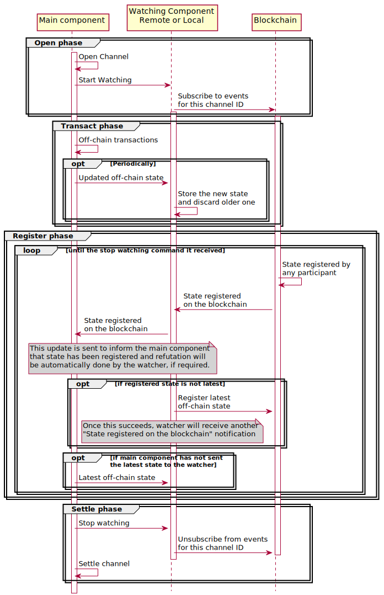

<!-- This is a template for proposing design changes to the perun project. -->

# Proposal: Watching service for IoT adoption

* Author(s): Manoranjith
* Status: accepted
* Related issue: [perun-proposals#008](https://github.com/hyperledger-labs/perun-proposals/pull/008),


<!-- Use the above format for issues on github and full links for issues on other platforms. -->

## Summary

<!-- Provide a tl;dr summary -->
The high level requirements for adopting the perun-framework for IoT use cases
was described in [perun-proposal#003](./003-IoT-Adoption.md). Detailed
description of the functionality and design for implementing the watching
component is proposed.


## Motivation

<!-- introduction to the problem being solved & its background.  -->

In the current implementation of the framework (go-perun v0.6.0), the watcher is
integrated into `client.Channel` type and an instance must be started for each
channel.

However, it is desirable to run the watcher as a separate component for IoT use
cases. Because, for the perun protocol to work, the watcher should be actively
watching the blockchain for any states being registered and if an older state is
registered, the watcher must immediately refute with the latest valid state.
Given the connectivity and power constraints of IoT devices, it might not be
possible to meet these requirements if watching service is running on the IoT
device.

Since the current design cannot be extended to implement a watcher that can run
as a remote service, a new design is proposed where, the watcher can run:
1. In the same instance as the go-perun client (ideal for capable hardware).
2. In a separate instance as a remote service (ideal for constrained hardware).

## Details

<!-- Provide a detailed description of the proposal. -->

This section describes the proposed design for watching component and the
implementation hints are described in the last section of this proposal.

In the proposed design, the watcher is started once per client instance, as
opposed to one watcher per channel in the current design. Interfaces for
initializing the watcher, using it and shutting it down are described below.

### Initializing the watcher

Watcher should be initialized with a connection to blockchain that is capable of
1. Subscribing to on-chain register events for a given channel.
2. Send Register transactions on the blockchain.

These two functionalities can be provided by using a subset of the current
`channel.Adjudicator` interface comprising of only two methods: `Register` and
`Subscriber`. This interface could be called `RegistererSubscriber` (or even by
a different name).

Using the new interface, the signature of the method for initialization would
be,

```
watcher, err := NewWatcher(rs RegisterSubscriber)
```

This watching service can run either locally or as remote instance. The returned
watcher instance can be used to interact with the watcher.

### Using the watcher

New channel IDs can be registered with/de-registered from the watcher using the
method calls on the watcher instance. To send updated off-chain states and
receive registered events (optional, when watcher has noticed an older state
being registered on the blockchain and refutes with the latest state), two
pub-sub interfaces are defined.

1. `OffChainStatesPubSub`: Channel instance will publish updated off-chain
   states to this and watching component will read from it using a subscription.

2. `RegisterTxPubSub`: Watching component will publish the details of `register`
   transaction to this and the channel instance will read from it using a
   subscription.

Each of these pub-sub should provide `Publish` method on the `Publisher` and
`Next` method on the `Subscription`.

Using these two interfaces, the method for registering a channel ID with the
watcher will be:

```
err := watcher.Register(channelID, offChainStatesSub, registerTxPub)

```

The `offChainStatesSub` and `registerTxPub` are initialized by the channel
instance and passed on to the watching component. Because doing it this way,

- Initial implementation can be a one channel to one watcher pub-sub.
- Later if the same channel wants to use multiple watcher instances (because one
  watcher could not provide expected level of availability), then the one
  channel to multiple watcher pub-sub could also be implemented.

To stop the watcher from monitoring events for a given channel ID, a
`de-register` method should be defined. Interface of this method will be

```
err := watcher.Deregister(channelID)
```

When a channel is de-registered, the watcher should ignore any event received
for the channel ID.

### Shutting down the watcher

The watcher instance should also provide a method to shut it down. The signature
of this method will be

```
channelIDs := watcher.Shutdown()
```

On receiving the signal to shut itself down, the watcher should
1. Stop watching for all the channel IDs registered with it.
2. Complete any on-going refutation process.
3. Return with all the channel IDs that were registered with it.

The interaction between the watcher and the main component is described in the
sequence diagram:



Figure 1: Interaction between the main component and watcher.

## Rationale

<!-- Provide a discussion of alternative approaches and trade offs; advantages
and disadvantages of the specified approach.  -->

The proposed design

- Ensures watching component can be run either locally or as a remote service
  and be connected to the blockchain in either case.

- Ensures a channel instance can register with one or more watching components.
  This is achieved by keeping the control of initializing all the pub-sub
  components with the channel instance.

## Impact

<!-- Choose the level of impact this proposal will have: -->

<!-- Minor (Does not impact any existing features) -->
<!-- Major (Breaks one or more existing features) -->
<!-- New Feature (Introduces a functionality) -->
Architecture (Requires a modification of the architecture)

## Implementation

<!-- Provide a description of the implementation aspects. -->

The implementation hints are described assuming the language to be `go`.
However, these could also be extended to other languages as well.

An important point to note is that, `off-chain states` should be sent to the
watcher along with the corresponding signatures. Currently, `go-perun` does not
have a method for retrieving this, So a new method should be added for the same.

To implement a watching component that works locally,

1. The watching component can be run as a `go-routine`, started by invoking the
`NewWatcher` function and,
2. The pub-sub interfaces can be implemented using `go-channels`.

To implement a watching component that runs as a remote service,

1. The watching component can be started to run as an independent program.
2. The main program could connect to the watcher by invoking the `NewWatcher`
   function with the `URL` to connect with the watching component started
   earlier.
3. The connection to the remote watching component and pub-sub interface can be
   implemented remote protocols like `grpc` or `MQTT`.
